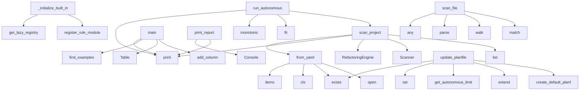

# System Architecture Analysis

## Overview

- **Project**: /home/tom/github/semcod/prefact
- **Primary Language**: python
- **Languages**: python: 104, yaml: 37, json: 3, shell: 2, txt: 2
- **Analysis Mode**: static
- **Total Functions**: 3484
- **Total Classes**: 146
- **Modules**: 153
- **Entry Points**: 3411

## Architecture by Module

### project.map.toon
- **Functions**: 28684
- **File**: `map.toon.yaml`

### vscode-extension.src.extension
- **Functions**: 58
- **Classes**: 5
- **File**: `extension.ts`

### src.prefact.rules.string_transformations
- **Functions**: 27
- **Classes**: 6
- **File**: `string_transformations.py`

### src.prefact.rules.importchecker_based
- **Functions**: 24
- **Classes**: 5
- **File**: `importchecker_based.py`

### src.prefact.rules.import_linter_based
- **Functions**: 24
- **Classes**: 5
- **File**: `import_linter_based.py`

### src.prefact.performance.parallel
- **Functions**: 23
- **Classes**: 4
- **File**: `parallel.py`

### src.prefact.rules.isort_based
- **Functions**: 23
- **Classes**: 4
- **File**: `isort_based.py`

### src.prefact.rules.pylint_based
- **Functions**: 22
- **Classes**: 5
- **File**: `pylint_based.py`

### src.prefact.rules.unimport_based
- **Functions**: 22
- **Classes**: 5
- **File**: `unimport_based.py`

### src.prefact.rules.mypy_based
- **Functions**: 22
- **Classes**: 6
- **File**: `mypy_based.py`

### src.prefact.rules.ruff_based
- **Functions**: 19
- **Classes**: 6
- **File**: `ruff_based.py`

### src.prefact.rules.autoflake_based
- **Functions**: 19
- **Classes**: 3
- **File**: `autoflake_based.py`

### src.prefact.git_hooks
- **Functions**: 17
- **Classes**: 2
- **File**: `git_hooks.py`

### src.prefact.autonomous
- **Functions**: 17
- **Classes**: 1
- **File**: `__init__.py`

### src.prefact.plugins
- **Functions**: 17
- **Classes**: 3
- **File**: `__init__.py`

### src.prefact.performance.cache_adapters
- **Functions**: 16
- **Classes**: 4
- **File**: `cache_adapters.py`

### src.prefact.rules.composite_rules
- **Functions**: 16
- **Classes**: 3
- **File**: `composite_rules.py`

### src.prefact.logging.logger
- **Functions**: 15
- **Classes**: 2
- **File**: `logger.py`

### src.prefact.autonomous.todo_manager
- **Functions**: 15
- **Classes**: 1
- **File**: `todo_manager.py`

### src.prefact.config
- **Functions**: 13
- **Classes**: 2
- **File**: `config.py`

## Key Entry Points

Main execution flows into the system:

### src.prefact.autonomous.project_scanner.ProjectScanner.scan_project
> Scan project for issues.
- **Calls**: ExtendedConfig.from_yaml, console.print, RefactoringEngine, Scanner, list, self.get_autonomous_limit, self._scan_files_with_progress, console.print

### src.prefact.rules.registry._initialize_built_in_rules
> Initialize built-in rule mappings.
- **Calls**: src.prefact.rules.registry.get_lazy_registry, registry.register_rule_module, registry.register_rule_module, registry.register_rule_module, registry.register_rule_module, registry.register_rule_module, registry.register_rule_module, registry.register_rule_module

### examples.run_examples.main
> Run all examples and show results.
- **Calls**: console.print, examples.run_examples.find_examples, console.print, Table, table.add_column, table.add_column, table.add_column, console.print

### src.prefact.autonomous.docs_manager.DocsManager.update_planfile
> Update planfile.yaml with new tickets.
- **Calls**: self.planfile_path.exists, src.prefact.performance.cache.Cache.set, self.get_autonomous_limit, None.extend, self.create_default_planfile, self.create_ticket_from_issue, None.append, project.map.toon.open

### src.prefact.reporters.console.print_report
- **Calls**: Console, console.print, console.print, console.print, console.print, console.print, Panel, Table

### src.prefact.config_extended.models.ExtendedConfig.from_yaml
- **Calls**: None.items, cls, path.exists, cls, project.map.toon.open, src.prefact.config_extended.utils.deep_merge, isinstance, yaml.safe_load

### benchmark_ram_optimization.main
> Run multiple benchmarks with different file counts and sizes.
- **Calls**: Taskfile.print, Taskfile.print, Taskfile.print, Taskfile.print, Taskfile.print, Taskfile.print, Taskfile.print, Taskfile.print

### src.prefact.autonomous.AutonomousRefact.run_autonomous
> Run autonomous prefact process.
- **Calls**: console.print, monotonic, Panel.fit, console.print, self.scan_project, self.scanner.get_autonomous_limit, console.print, self.update_planfile

### src.prefact.rules.magic_numbers.MagicNumberRule.scan_file
- **Calls**: any, ast.parse, ast.walk, re.match, isinstance, isinstance, isinstance, self._is_magic_number

### src.prefact.config_extended.config.ExtendedConfig.from_yaml
> Load configuration from YAML file with environment support.
- **Calls**: cls._parse_rules, raw.pop, raw.pop, raw.pop, raw.pop, raw.pop, raw.pop, cls

### src.prefact.rules.mypy_based.MyPyHelper.check_file
> Run MyPy on a single file and return JSON results.
- **Calls**: tempfile.TemporaryDirectory, Path, str, str, config.get, config.get, subprocess.run, report_file.exists

### src.prefact.autonomous.todo_manager.TodoManager._parse_existing_todos
> Parse existing TODO.md entries.
- **Calls**: self.todo_path.read_text, existing_content.split, self.todo_path.exists, len, None.strip, line.startswith, line.startswith, None.strip

### src.prefact.rules.composite_factory.CompositeRuleFactory.create_composite_rule
> Create a composite rule dynamically.
- **Calls**: None.__init__, self._create_strategy, self._load_tools, src.prefact.rules.registry.LazyRuleRegistry.get_all_rules, self.strategy.scan, self.strategy.fix, ValidationResult, SequentialScanStrategy

### src.prefact.rules.relative_imports.RelativeToAbsoluteImports.validate
- **Calls**: ValidationResult, ast.parse, checks.append, ast.parse, ast.walk, sum, sum, errors.append

### vscode-extension.src.extension.PrefactTreeProvider.activate
- **Calls**: vscode-extension.src.extension.log, vscode-extension.src.extension.PrefactDiagnosticsProvider, vscode-extension.src.extension.PrefactTreeProvider, vscode-extension.src.extension.createTreeView, vscode-extension.src.extension.registerCommand, vscode-extension.src.extension.openTextDocument, vscode-extension.src.extension.PrefactDiagnosticsProvider.scanFile, vscode-extension.src.extension.PrefactDiagnosticsProvider.scanWorkspace

### src.prefact.autonomous.project_scanner.ProjectScanner._scan_files_parallel
> Scan files using parallel processing.
- **Calls**: min, console.print, config.performance.get, len, ThreadPoolExecutor, as_completed, file_path.read_text, executor.submit

### src.prefact.rules.composite_rules.CompositeImportRules._load_tools
> Load all import-related tools.
- **Calls**: self.config.is_rule_enabled, self.config.is_rule_enabled, self.config.is_rule_enabled, self.config.is_rule_enabled, self.config.is_rule_enabled, tools.extend, tools.append, tools.append

### examples.sample-project.cli.main
> Main CLI command.
- **Calls**: click.command, click.option, click.option, Taskfile.print, User, Taskfile.print, DataProcessor, processor.add_item

### src.prefact.cli.autonomous_cmd
> Run autonomous prefact mode (-a).

Automatically initializes prefact.yaml if missing, runs examples,
scans for issues, and creates tickets in planfile
- **Calls**: main.command, click.option, click.option, click.option, click.option, click.option, Console, AutonomousRefact

### src.prefact.benchmark.ScanProbe.run
- **Calls**: textwrap.dedent, BenchmarkResult, tempfile.TemporaryDirectory, Path, vscode-extension.src.extension.PrefactDiagnosticsProvider.range, Config, RefactoringEngine, time.perf_counter

### src.prefact.rules.importchecker_based.ImportCheckerUnusedImports._find_import_lines
> Find line numbers for each import.
- **Calls**: source.splitlines, enumerate, line.strip, stripped.startswith, stripped.startswith, stripped.split, None.split, len

### src.prefact.engine.RefactoringEngine.run
- **Calls**: PipelineResult, self.scanner.collect_files, self._preload_sources, issues_map.values, issues_map.items, issues_map.update, issues_map.update, result.issues_found.extend

### src.prefact.performance.cache.cached_file_operation
> Decorator to cache file operations.
- **Calls**: src.prefact.performance.cache.get_hash_cache, hash_cache.get_hash, src.prefact.performance.cache.get_cache, cache.get, func, cache.set, func, hash_cache.set_hash

### src.prefact.rules.importchecker_based.ImportOptimizer._extract_all_imports
> Extract all imports with their locations.
- **Calls**: source.splitlines, enumerate, line.strip, stripped.startswith, stripped.startswith, stripped.split, None.split, len

### src.prefact.rules.migration.RuleMigrationManager.create_hybrid_rule
> Create a hybrid rule that can switch between AST and Ruff.
- **Calls**: None.get, None.__init__, RuleMigrationManager, self.migration_manager.should_use_ruff, self.ast_rule.scan_file, self.migration_manager.should_use_ruff, self.ast_rule.fix, self.migration_manager.should_use_ruff

### src.prefact.plugins.PluginManager.load_plugin
> Load a plugin and register its rules.
- **Calls**: Taskfile.print, PluginValidator.validate_plugin_module, metadata.entry_point.split, importlib.import_module, getattr, callable, self._loaded_modules.add, Taskfile.print

### src.prefact.autonomous.todo_manager.TodoManager._parse_todo_tasks
> Parse active tasks from TODO.md.
- **Calls**: self.todo_path.read_text, content.split, None.startswith, line.strip, None.startswith, None.startswith, line.strip, line.strip

### src.prefact.autonomous.setup_manager.SetupManager.run_examples
> Run all examples and verify they work.
- **Calls**: list, self.examples_dir.exists, console.print, self.examples_dir.rglob, console.print, Progress, progress.add_task, progress.advance

### src.prefact.rules.unimport_based.UnimportUnusedImports.scan_file
- **Calls**: UnimportHelper.check_source, source.splitlines, enumerate, line.strip, stripped.startswith, item.get, import_lines.get, issues.append

### src.prefact.plugins.PluginManager._discover_local_plugins
> Discover plugins in a local directory.
- **Calls**: plugin_dir.glob, PluginValidator.validate_plugin_path, importlib.util.spec_from_file_location, importlib.util.module_from_spec, spec.loader.exec_module, PluginMetadata, plugins.append, Taskfile.print

## Process Flows

Key execution flows identified:

### Flow 1: scan_project
```
scan_project [src.prefact.autonomous.project_scanner.ProjectScanner]
```

### Flow 2: _initialize_built_in_rules
```
_initialize_built_in_rules [src.prefact.rules.registry]
  └─> get_lazy_registry
```

### Flow 3: main
```
main [examples.run_examples]
  └─> find_examples
```

### Flow 4: update_planfile
```
update_planfile [src.prefact.autonomous.docs_manager.DocsManager]
  └─ →> set
```

### Flow 5: print_report
```
print_report [src.prefact.reporters.console]
```

### Flow 6: from_yaml
```
from_yaml [src.prefact.config_extended.models.ExtendedConfig]
  └─ →> open
```

### Flow 7: run_autonomous
```
run_autonomous [src.prefact.autonomous.AutonomousRefact]
```

### Flow 8: scan_file
```
scan_file [src.prefact.rules.magic_numbers.MagicNumberRule]
```

### Flow 9: check_file
```
check_file [src.prefact.rules.mypy_based.MyPyHelper]
```

### Flow 10: _parse_existing_todos
```
_parse_existing_todos [src.prefact.autonomous.todo_manager.TodoManager]
```

## Key Classes

### vscode-extension.src.extension.PrefactDiagnosticsProvider
- **Methods**: 32
- **Key Methods**: vscode-extension.src.extension.PrefactDiagnosticsProvider.scanFile, vscode-extension.src.extension.PrefactDiagnosticsProvider.config, vscode-extension.src.extension.PrefactDiagnosticsProvider.result, vscode-extension.src.extension.PrefactDiagnosticsProvider.scanWorkspace, vscode-extension.src.extension.PrefactDiagnosticsProvider.workspaceFolders, vscode-extension.src.extension.PrefactDiagnosticsProvider.config, vscode-extension.src.extension.PrefactDiagnosticsProvider.result, vscode-extension.src.extension.PrefactDiagnosticsProvider.fixFile, vscode-extension.src.extension.PrefactDiagnosticsProvider.doc, vscode-extension.src.extension.PrefactDiagnosticsProvider.fixWorkspace

### vscode-extension.src.extension.PrefactTreeProvider
- **Methods**: 25
- **Key Methods**: vscode-extension.src.extension.PrefactTreeProvider.refresh, vscode-extension.src.extension.PrefactTreeProvider.getTreeItem, vscode-extension.src.extension.PrefactTreeProvider.getChildren, vscode-extension.src.extension.PrefactTreeProvider.issuesByFile, vscode-extension.src.extension.PrefactTreeProvider.file, vscode-extension.src.extension.PrefactTreeProvider.item, vscode-extension.src.extension.PrefactTreeProvider.fileIssues, vscode-extension.src.extension.PrefactTreeProvider.item, vscode-extension.src.extension.PrefactTreeProvider.activate, vscode-extension.src.extension.PrefactTreeProvider.diagnosticsProvider

### src.prefact.autonomous.AutonomousRefact
> Autonomous prefact manager.
- **Methods**: 17
- **Key Methods**: src.prefact.autonomous.AutonomousRefact.__init__, src.prefact.autonomous.AutonomousRefact.run_autonomous, src.prefact.autonomous.AutonomousRefact.create_refact_config, src.prefact.autonomous.AutonomousRefact.detect_project_info, src.prefact.autonomous.AutonomousRefact.run_examples, src.prefact.autonomous.AutonomousRefact.scan_project, src.prefact.autonomous.AutonomousRefact.group_issues, src.prefact.autonomous.AutonomousRefact.update_planfile, src.prefact.autonomous.AutonomousRefact.create_default_planfile, src.prefact.autonomous.AutonomousRefact.create_ticket_from_issue

### src.prefact.logging.logger.PprefactLogger
- **Methods**: 15
- **Key Methods**: src.prefact.logging.logger.PprefactLogger.__init__, src.prefact.logging.logger.PprefactLogger._setup_handlers, src.prefact.logging.logger.PprefactLogger.debug, src.prefact.logging.logger.PprefactLogger.info, src.prefact.logging.logger.PprefactLogger.warning, src.prefact.logging.logger.PprefactLogger.error, src.prefact.logging.logger.PprefactLogger.critical, src.prefact.logging.logger.PprefactLogger._log, src.prefact.logging.logger.PprefactLogger._send_telemetry, src.prefact.logging.logger.PprefactLogger.add_telemetry_callback

### src.prefact.autonomous.todo_manager.TodoManager
> Manages TODO.md file operations.
- **Methods**: 15
- **Key Methods**: src.prefact.autonomous.todo_manager.TodoManager.__init__, src.prefact.autonomous.todo_manager.TodoManager.update_todo_md, src.prefact.autonomous.todo_manager.TodoManager._parse_existing_todos, src.prefact.autonomous.todo_manager.TodoManager._generate_current_todos, src.prefact.autonomous.todo_manager.TodoManager._find_completed_tasks, src.prefact.autonomous.todo_manager.TodoManager._write_todo_md, src.prefact.autonomous.todo_manager.TodoManager._get_relative_file_path, src.prefact.autonomous.todo_manager.TodoManager.execute_todos, src.prefact.autonomous.todo_manager.TodoManager._parse_todo_tasks, src.prefact.autonomous.todo_manager.TodoManager._get_refactoring_config
- **Inherits**: BaseManager

### src.prefact.config.Config
> Top-level configuration.
- **Methods**: 13
- **Key Methods**: src.prefact.config.Config.from_yaml, src.prefact.config.Config._parse_rules, src.prefact.config.Config._get_default_patterns, src.prefact.config.Config.rule_enabled, src.prefact.config.Config.is_rule_enabled, src.prefact.config.Config.rule_options, src.prefact.config.Config.get_rule_option, src.prefact.config.Config.set_rule_option, src.prefact.config.Config.detect_package_name, src.prefact.config.Config._detect_from_pyproject

### src.prefact.git_hooks.GitHooks
> Manages Git hooks for prefact.
- **Methods**: 11
- **Key Methods**: src.prefact.git_hooks.GitHooks.__init__, src.prefact.git_hooks.GitHooks._find_git_dir, src.prefact.git_hooks.GitHooks.install_hooks, src.prefact.git_hooks.GitHooks._install_hook, src.prefact.git_hooks.GitHooks._generate_hook_script, src.prefact.git_hooks.GitHooks._pre_commit_hook, src.prefact.git_hooks.GitHooks._pre_push_hook, src.prefact.git_hooks.GitHooks._commit_msg_hook, src.prefact.git_hooks.GitHooks.uninstall_hooks, src.prefact.git_hooks.GitHooks.list_hooks

### src.prefact.plugins.PluginManager
> Manages loading and registration of plugins.
- **Methods**: 11
- **Key Methods**: src.prefact.plugins.PluginManager.__init__, src.prefact.plugins.PluginManager.discover_plugins, src.prefact.plugins.PluginManager._discover_entry_point_plugins, src.prefact.plugins.PluginManager._discover_local_plugins, src.prefact.plugins.PluginManager.load_plugin, src.prefact.plugins.PluginManager.load_all_plugins, src.prefact.plugins.PluginManager.get_rule, src.prefact.plugins.PluginManager._load_plugin_for_rule, src.prefact.plugins.PluginManager.list_plugins, src.prefact.plugins.PluginManager._is_rule_from_plugin

### src.prefact.autonomous.dependency_checker.DependencyChecker
> Checks for outdated project dependencies.
- **Methods**: 11
- **Key Methods**: src.prefact.autonomous.dependency_checker.DependencyChecker.__init__, src.prefact.autonomous.dependency_checker.DependencyChecker.check_dependencies, src.prefact.autonomous.dependency_checker.DependencyChecker._collect_declared_deps, src.prefact.autonomous.dependency_checker.DependencyChecker._parse_pyproject_toml, src.prefact.autonomous.dependency_checker.DependencyChecker._parse_requirements_files, src.prefact.autonomous.dependency_checker.DependencyChecker._query_pip_outdated, src.prefact.autonomous.dependency_checker.DependencyChecker._build_issue_groups, src.prefact.autonomous.dependency_checker.DependencyChecker._find_dep_source_file, src.prefact.autonomous.dependency_checker.DependencyChecker._find_dep_line, src.prefact.autonomous.dependency_checker.DependencyChecker._normalize
- **Inherits**: BaseManager

### src.prefact.rules.llm_generated_code.LLMGeneratedCodeRule
> Detect code that appears to be LLM-generated.
- **Methods**: 9
- **Key Methods**: src.prefact.rules.llm_generated_code.LLMGeneratedCodeRule.__init__, src.prefact.rules.llm_generated_code.LLMGeneratedCodeRule._load_indicators, src.prefact.rules.llm_generated_code.LLMGeneratedCodeRule.scan_file, src.prefact.rules.llm_generated_code.LLMGeneratedCodeRule._check_comment_ratio, src.prefact.rules.llm_generated_code.LLMGeneratedCodeRule._check_docstring_patterns, src.prefact.rules.llm_generated_code.LLMGeneratedCodeRule._has_llm_docstring_pattern, src.prefact.rules.llm_generated_code.LLMGeneratedCodeRule._map_severity, src.prefact.rules.llm_generated_code.LLMGeneratedCodeRule.fix, src.prefact.rules.llm_generated_code.LLMGeneratedCodeRule.validate
- **Inherits**: BaseRule

### src.prefact.rules.llm_hallucinations.LLMHallucinationRule
> Detect LLM hallucination patterns in code.
- **Methods**: 9
- **Key Methods**: src.prefact.rules.llm_hallucinations.LLMHallucinationRule.__init__, src.prefact.rules.llm_hallucinations.LLMHallucinationRule._load_patterns, src.prefact.rules.llm_hallucinations.LLMHallucinationRule.scan_file, src.prefact.rules.llm_hallucinations.LLMHallucinationRule._check_ast_patterns, src.prefact.rules.llm_hallucinations.LLMHallucinationRule._is_suspicious_function_name, src.prefact.rules.llm_hallucinations.LLMHallucinationRule._is_suspicious_import, src.prefact.rules.llm_hallucinations.LLMHallucinationRule._map_severity, src.prefact.rules.llm_hallucinations.LLMHallucinationRule.fix, src.prefact.rules.llm_hallucinations.LLMHallucinationRule.validate
- **Inherits**: BaseRule

### src.prefact.config_extended.config.ExtendedConfig
> Extended configuration with additional features.
- **Methods**: 8
- **Key Methods**: src.prefact.config_extended.config.ExtendedConfig.__init__, src.prefact.config_extended.config.ExtendedConfig.from_yaml, src.prefact.config_extended.config.ExtendedConfig._parse_rules, src.prefact.config_extended.config.ExtendedConfig._deep_merge, src.prefact.config_extended.config.ExtendedConfig.get_tool_config, src.prefact.config_extended.config.ExtendedConfig.get_performance_setting, src.prefact.config_extended.config.ExtendedConfig.get_plugin_config, src.prefact.config_extended.config.ExtendedConfig.to_dict
- **Inherits**: Config

### src.prefact.rules.unused_imports.UnusedImports
- **Methods**: 8
- **Key Methods**: src.prefact.rules.unused_imports.UnusedImports.scan_file, src.prefact.rules.unused_imports.UnusedImports.validate, src.prefact.rules.unused_imports.UnusedImports.fix, src.prefact.rules.unused_imports.UnusedImports.remove_lines, src.prefact.rules.unused_imports.UnusedImports.process_import_from, src.prefact.rules.unused_imports.UnusedImports.process_import, src.prefact.rules.unused_imports.UnusedImports._remove_unused_from_line, src.prefact.rules.unused_imports.UnusedImports._remove_unused_from_import_line
- **Inherits**: BaseRule

### src.prefact.rules.registry.LazyRuleRegistry
> Registry that lazily loads rule classes.
- **Methods**: 8
- **Key Methods**: src.prefact.rules.registry.LazyRuleRegistry.__init__, src.prefact.rules.registry.LazyRuleRegistry.get_rule, src.prefact.rules.registry.LazyRuleRegistry._load_module, src.prefact.rules.registry.LazyRuleRegistry._find_rule_class, src.prefact.rules.registry.LazyRuleRegistry.get_all_rules, src.prefact.rules.registry.LazyRuleRegistry.list_available_rules, src.prefact.rules.registry.LazyRuleRegistry.register_rule, src.prefact.rules.registry.LazyRuleRegistry.register_rule_module

### src.prefact.rules.string_transformations.ContextAwareStringTransformer
> Transform string concatenations with context awareness.
- **Methods**: 8
- **Key Methods**: src.prefact.rules.string_transformations.ContextAwareStringTransformer.__init__, src.prefact.rules.string_transformations.ContextAwareStringTransformer.visit_FunctionDef, src.prefact.rules.string_transformations.ContextAwareStringTransformer.leave_FunctionDef, src.prefact.rules.string_transformations.ContextAwareStringTransformer.visit_ClassDef, src.prefact.rules.string_transformations.ContextAwareStringTransformer.leave_ClassDef, src.prefact.rules.string_transformations.ContextAwareStringTransformer.leave_BinaryOperation, src.prefact.rules.string_transformations.ContextAwareStringTransformer._should_skip_context, src.prefact.rules.string_transformations.ContextAwareStringTransformer._is_in_logging_statement
- **Inherits**: cst.CSTTransformer

### src.prefact.performance.parallel.ParallelEngine
> Parallel processing engine for prefact.
- **Methods**: 7
- **Key Methods**: src.prefact.performance.parallel.ParallelEngine.__init__, src.prefact.performance.parallel.ParallelEngine.scan_files, src.prefact.performance.parallel.ParallelEngine._scan_with_thread_pool, src.prefact.performance.parallel.ParallelEngine._scan_with_process_pool, src.prefact.performance.parallel.ParallelEngine._execute_task_wrapper, src.prefact.performance.parallel.ParallelEngine._get_enabled_rule_ids, src.prefact.performance.parallel.ParallelEngine.fix_files

### src.prefact.performance.cache.Cache
> Wrapper for diskcache with additional functionality.
- **Methods**: 7
- **Key Methods**: src.prefact.performance.cache.Cache.__init__, src.prefact.performance.cache.Cache.get, src.prefact.performance.cache.Cache.set, src.prefact.performance.cache.Cache.delete, src.prefact.performance.cache.Cache.clear, src.prefact.performance.cache.Cache.get_stats, src.prefact.performance.cache.Cache.close

### src.prefact.performance.cache.base.Cache
> Wrapper for diskcache with additional functionality.
- **Methods**: 7
- **Key Methods**: src.prefact.performance.cache.base.Cache.__init__, src.prefact.performance.cache.base.Cache.get, src.prefact.performance.cache.base.Cache.set, src.prefact.performance.cache.base.Cache.delete, src.prefact.performance.cache.base.Cache.clear, src.prefact.performance.cache.base.Cache.get_stats, src.prefact.performance.cache.base.Cache.close

### src.prefact.autonomous.docs_manager.DocsManager
> Manages documentation files - planfile.yaml and CHANGELOG.md.
- **Methods**: 7
- **Key Methods**: src.prefact.autonomous.docs_manager.DocsManager.__init__, src.prefact.autonomous.docs_manager.DocsManager.update_planfile, src.prefact.autonomous.docs_manager.DocsManager._count_existing_tickets, src.prefact.autonomous.docs_manager.DocsManager.create_default_planfile, src.prefact.autonomous.docs_manager.DocsManager.create_ticket_from_issue, src.prefact.autonomous.docs_manager.DocsManager.ticket_exists, src.prefact.autonomous.docs_manager.DocsManager.update_changelog_md
- **Inherits**: BaseManager

### src.prefact.autonomous.project_scanner.ProjectScanner
> Handles project scanning operations.
- **Methods**: 7
- **Key Methods**: src.prefact.autonomous.project_scanner.ProjectScanner.__init__, src.prefact.autonomous.project_scanner.ProjectScanner.scan_project, src.prefact.autonomous.project_scanner.ProjectScanner._scan_files_with_progress, src.prefact.autonomous.project_scanner.ProjectScanner._scan_files_parallel, src.prefact.autonomous.project_scanner.ProjectScanner._scan_files_sequential, src.prefact.autonomous.project_scanner.ProjectScanner._scan_single_file, src.prefact.autonomous.project_scanner.ProjectScanner.group_issues
- **Inherits**: BaseManager

## Data Transformation Functions

Key functions that process and transform data:

### examples.01-individual-rules.relative-imports.after.process_user
> Process a user.
- **Output to**: UserModel, examples.sample-project.utils.helper_function

### examples.01-individual-rules.relative-imports.after.Processor.process
- **Output to**: examples.01-individual-rules.string-concat.after.format_data

### examples.01-individual-rules.relative-imports.before.process_user
> Process a user.
- **Output to**: UserModel, examples.sample-project.utils.helper_function

### examples.01-individual-rules.relative-imports.before.Processor.process
- **Output to**: examples.01-individual-rules.string-concat.after.format_data

### examples.01-individual-rules.wildcard-imports.after.process
> Process using wildcard imports.
- **Output to**: defaultdict

### examples.01-individual-rules.wildcard-imports.before.process
> Process using wildcard imports.
- **Output to**: defaultdict

### examples.01-individual-rules.missing-return-type.after.Processor.process
> Process data.
- **Output to**: data.upper

### examples.01-individual-rules.missing-return-type.before.Processor.process
> Process data.
- **Output to**: data.upper

### examples.01-individual-rules.duplicate-imports.after.process_data
> Process data.
- **Output to**: os.getcwd

### examples.01-individual-rules.duplicate-imports.before.process_data
> Process data.
- **Output to**: os.getcwd

### examples.01-individual-rules.unused-imports.after.process_data
> Process some data.
- **Output to**: item.lower, len

### examples.01-individual-rules.unused-imports.after.format_timestamp
> Format a timestamp.
- **Output to**: ts.strftime

### examples.01-individual-rules.unused-imports.before.process_data
> Process some data.
- **Output to**: item.lower, len

### examples.01-individual-rules.unused-imports.before.format_timestamp
> Format a timestamp.
- **Output to**: ts.strftime

### examples.01-individual-rules.string-concat.after.format_data
> Format data.

### examples.01-individual-rules.string-concat.before.format_data
> Format data.
- **Output to**: str

### examples.01-individual-rules.sorted-imports.after.process
> Process with unsorted imports.

### examples.01-individual-rules.sorted-imports.before.process
> Process with unsorted imports.

### examples.01-individual-rules.print-statements.after.process_data
> Process data with debug prints.
- **Output to**: Taskfile.print, Taskfile.print

### examples.01-individual-rules.print-statements.before.process_data
> Process data with debug prints.
- **Output to**: Taskfile.print, Taskfile.print

### examples.02-multiple-rules.messy_module.process_users
> Process user data with multiple issues.
- **Output to**: Taskfile.print, processed.append, Taskfile.print

### examples.02-multiple-rules.messy_module.DataProcessor.process
> Process items.
- **Output to**: Taskfile.print, str, len, len

### examples.sample-project.utils.format_name
> Format a full name.
- **Output to**: Taskfile.print

### examples.sample-project.utils.validate_email
> Validate email address.
- **Output to**: re.match, Taskfile.print, Taskfile.print

### examples.sample-project.core.process_data
> Process some data without return type annotation.
- **Output to**: Taskfile.print, str

## Behavioral Patterns

### recursion_deep_merge
- **Type**: recursion
- **Confidence**: 0.90
- **Functions**: src.prefact.config_extended.utils.deep_merge

### recursion__flatten_add
- **Type**: recursion
- **Confidence**: 0.90
- **Functions**: src.prefact.rules.string_concat._flatten_add

### recursion__module_to_str
- **Type**: recursion
- **Confidence**: 0.90
- **Functions**: src.prefact.rules.relative_imports._module_to_str

### state_machine_CacheContext
- **Type**: state_machine
- **Confidence**: 0.70
- **Functions**: src.prefact.performance.cache.CacheContext.__init__, src.prefact.performance.cache.CacheContext.__enter__, src.prefact.performance.cache.CacheContext.__exit__

### state_machine_RuffPrintStatements
- **Type**: state_machine
- **Confidence**: 0.70
- **Functions**: src.prefact.rules.ruff_based.RuffPrintStatements.scan_file, src.prefact.rules.ruff_based.RuffPrintStatements._should_ignore_file, src.prefact.rules.ruff_based.RuffPrintStatements.fix, src.prefact.rules.ruff_based.RuffPrintStatements.validate

### state_machine_PylintPrintStatements
- **Type**: state_machine
- **Confidence**: 0.70
- **Functions**: src.prefact.rules.pylint_based.PylintPrintStatements.__init__, src.prefact.rules.pylint_based.PylintPrintStatements._load_pylint_config, src.prefact.rules.pylint_based.PylintPrintStatements.scan_file, src.prefact.rules.pylint_based.PylintPrintStatements.fix, src.prefact.rules.pylint_based.PylintPrintStatements.validate

### state_machine_PrintStatements
- **Type**: state_machine
- **Confidence**: 0.70
- **Functions**: src.prefact.rules.print_statements.PrintStatements.scan_file, src.prefact.rules.print_statements.PrintStatements.fix, src.prefact.rules.print_statements.PrintStatements.validate

## Public API Surface

Functions exposed as public API (no underscore prefix):

- `src.prefact.autonomous.project_scanner.ProjectScanner.scan_project` - 34 calls
- `examples.06-api-usage.example.run_prefact_example` - 28 calls
- `src.prefact.benchmark.build_prefact_suite` - 26 calls
- `examples.run_examples.main` - 25 calls
- `src.prefact.autonomous.docs_manager.DocsManager.update_planfile` - 25 calls
- `src.prefact.reporters.console.print_report` - 24 calls
- `src.prefact.config_extended.models.ExtendedConfig.from_yaml` - 24 calls
- `benchmark_ram_optimization.main` - 22 calls
- `src.prefact.autonomous.AutonomousRefact.run_autonomous` - 22 calls
- `src.prefact.rules.magic_numbers.MagicNumberRule.scan_file` - 22 calls
- `src.prefact.config_extended.config.ExtendedConfig.from_yaml` - 21 calls
- `src.prefact.rules.mypy_based.MyPyHelper.check_file` - 21 calls
- `src.prefact.rules.benchmark.benchmark_file` - 21 calls
- `src.prefact.rules.composite_factory.CompositeRuleFactory.create_composite_rule` - 20 calls
- `src.prefact.rules.relative_imports.RelativeToAbsoluteImports.validate` - 20 calls
- `vscode-extension.src.extension.PrefactTreeProvider.activate` - 20 calls
- `examples.06-api-usage.example.batch_processing_example` - 19 calls
- `examples.sample-project.cli.main` - 18 calls
- `src.prefact.cli.autonomous_cmd` - 17 calls
- `src.prefact.benchmark.ScanProbe.run` - 17 calls
- `benchmark_ram_optimization.run_benchmark` - 16 calls
- `examples.06-api-usage.example.custom_rule_example` - 16 calls
- `src.prefact.engine.RefactoringEngine.run` - 16 calls
- `src.prefact.performance.cache.cached_file_operation` - 16 calls
- `src.prefact.rules.benchmark.print_benchmark_results` - 16 calls
- `src.prefact.rules.migration.RuleMigrationManager.create_hybrid_rule` - 16 calls
- `src.prefact.plugins.PluginManager.load_plugin` - 15 calls
- `src.prefact.autonomous.setup_manager.SetupManager.run_examples` - 15 calls
- `src.prefact.rules.unimport_based.UnimportUnusedImports.scan_file` - 15 calls
- `benchmark_ram_optimization.benchmark_without_rampreload` - 14 calls
- `src.prefact.performance.cache.cached_result` - 14 calls
- `src.prefact.autonomous.docs_manager.DocsManager.update_changelog_md` - 14 calls
- `src.prefact.autonomous.project_scanner.ProjectScanner.group_issues` - 14 calls
- `src.prefact.rules.unimport_based.UnimportAll.validate` - 14 calls
- `src.prefact.config.Config.from_yaml` - 13 calls
- `vscode-extension.src.extension.PrefactTreeProvider.getChildren` - 13 calls
- `src.prefact.git_hooks.main` - 12 calls
- `src.prefact.benchmark.main` - 12 calls
- `src.prefact.config_extended.validation.ConfigValidator.validate` - 12 calls
- `src.prefact.rules.import_linter_based.ImportLinterNoRelative.scan_file` - 12 calls

## System Interactions

How components interact:



## Reverse Engineering Guidelines

1. **Entry Points**: Start analysis from the entry points listed above
2. **Core Logic**: Focus on classes with many methods
3. **Data Flow**: Follow data transformation functions
4. **Process Flows**: Use the flow diagrams for execution paths
5. **API Surface**: Public API functions reveal the interface

## Context for LLM

Maintain the identified architectural patterns and public API surface when suggesting changes.